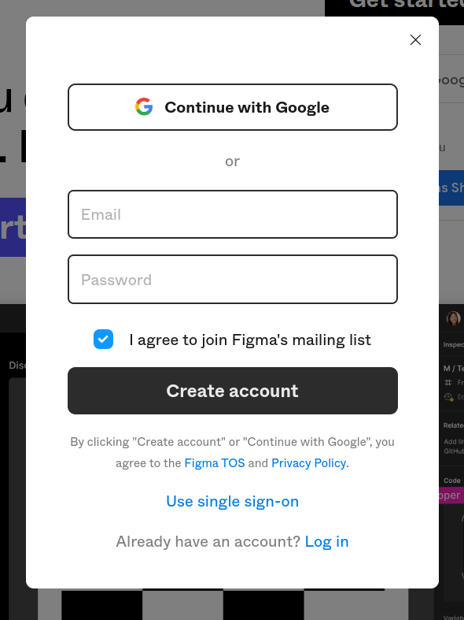
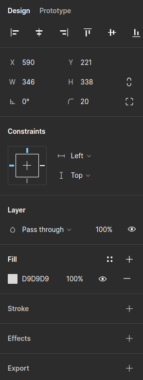

# Figma Lab

- [Overview](#overview)
- [Creating Your Figma Account](#creating-your-figma-account)
- [Creating Your First Figma Project](#creating-your-first-figma-project)
- [Adding Elements to Project](#adding-elements-to-project)
        - [Adding a Rectangle](#adding-a-rectangle)
        - [Adding a Circle](#adding-a-circle)
        - [Adding a Label](#adding-a-label)
- [Adjusting Properties](#adjusting-properties)
        - [Changing Corners](#changing-corners)
        - [Changing The Label](#changing-the-label)
        - [Changing Font](#changing-font)
        - [Changing Colors](#changing-shape-colors)
- [Challenge Object 1](#challenge-object-1)
- [Challenge Object 2](#challenge-object-2)
- [Porting Objects to a ACM Java Project](#porting-objects-to-a-acm-java-project)
        - [Exporting as attributes](#exporting-as-attributes)
        - [Exporting as an Image](#exporting-as-an-image)
- [Drawbacks](#drawbacks)
        - [Gradients](#gradients)
        - [Mixed Colors on Labels](#mixed-colors-on-labels)
        - [And More..](#and-more)
- [Sharing Figma Project](#sharing-figma-project)
- [What Next..](#what-next)

## Overview

Have you heard of Figma before this class? If so, this lab is for you.

This lab will be teaching you the simplest core functions of figma to
help you create a seamless connected UI across all screens in your Comp 55 Projects.

Figma is a powerful tool to help you line up your ideas before you
begin coding them, which is a nice thing to do if you generally like
to jump in and begin programming.

Upon completing this lab you will know how to:

- Create a figma project
- Add objects onto your figma project
- Edit object's properties
- Be able to port the design into comp 55

Submission for this lab will be:
// TODO am I even allowed to add submissions in the first place?

## Creating Your Figma Account

To Get Started with this lab, we will assume you've never touched figma
before and need to start from the first opening of the website.

Navigate to [Figma](www.figma.com) and then continue.

You'll immediately see a pretty website however we want to just create an account.

Find the button in the upper right corner that says "Get started for free"



I would reccomend just using your school email, so just click on "Continue with Google"

_If you want to use your personal email you can jump to [here](#personal-email)_

### Google Button

Continuing from before..

Click on your signed in school account.

Then it should take you into your home screen.

Now you have successfully created your Figma account.

[Click here to skip ahead](#finalizing-account)

### Personal Email

So to create an account using a personal email you will need
to just fill in some fields instead of just pressing a few buttons.

You will need to type in your email address and a password for this new account.

I would reccomend to disable the figma emailing list, but that's up to you to keep.

You will be provided with a message sent to that email, in which you
will need to click to verify your account.

Go ahead and click it.

After following it your account will be verified and you will need to log in.

#### Finalizing account

About here is where both routes of creating an account come together.

Fill out the forms that are provided

When you get to a step regarding a plan, pick the free one, as
most of the premium features aren't needed.

On the final step it will tell you to create a new file, go ahead and decline this.

Make sure to navigate to the home page before moving to the next step.

## Creating Your First Figma Project

At this point if you're inside of a project, go ahead and click on the
logo in the top left and then go back to files.

Once you're in the home page you can click on "design file" in the top right.
// design file gif

You will now be inside of your project and can move onto the next step.

## Adding Elements to Project

Now that we are inside of an empty project we can begin adding objects to our board.

### Adding a Frame

Figma's main power is to help you orient objects in reference to the top
left corner, which is how ACM orients objects.

To simulate a screen space for our graphics window we will select a frame
and then click and drag to create a new frame

Drag this to about 1240 x 1080, a screen resolution.

### Adding a Rectangle

Inside of the previous frame we can begin adding objects to it.

For this step go ahead and drag the rectangle in at any size you would like.

### Adding a Circle

In an open space click and drag to create a circle as well.

### Adding a Label

Inside of both shapes create a label for both in the same manner.

The tool you will use is the square that has a capital 'T' on it.

Name each label to the corresponding shape.

Ignore the small size of the label for now, as we'll change it in another step

## Adjusting Properties

Now that we have some shapes created we can start editing the shapes to
make them look different.

### Changing Corners

After clicking on the rectangle you can access the properties on the right-side.



For the corners option you can select the option to the right of the
curved line and switch that to 20

You'll immediately be able to see that the rectangle is now nicely
rounded as not as sharp.

### Changing The Label

To change the label, we'll start off with changing the color and alignment

Change the label so that the _circle_ is right bound, and the _square_ is left bound.

Along with this, highlight the text and then increase the font size to
a more reasonable size, but do not exceed the size of the shape.

Also go ahead and change the ***fill*** color of the square so that
the text is red.

On the circle, navigate to the stroke, press the plus sign to add a
stroke modifier and then change the stroke color to pink.

### Changing Font

Figma has a lot of built in fonts, this can always be adjusted later
when you import it into your java project.

For this step change the font of the circle to "Italianno" and the square
into any font you think looks good and then move on.

### Changing Shape Colors

I won't explain this step as it's akin to the previous steps for changing
the color and stroke of a label.

Change your square to a dark red and then change your circle's stroke to a
light blue, and line weight somewhere between 20 - 30.

#### By now your figma board should like something like


## Challenge Object 1

Here's the first challenge shape or shape(s); try to make something as
similar to this as possible.


## Challenge Object 2

Here's another challenge shape, a little harder but I'm sure you can do it.

A good thing to note about this shape is the heirarchy of items on the left
side, the higher up the object is, the more in front it is.


### A Quick Tip

A lot of organization down the road comes down to **Grouping**.

Grouping is very important due to the fact that it makes your heirarchy a little more manageable.

To group objects, select the components you would like to group and then press "ctrl + g"

This will group them and make it into a single project named "Group [x]",
x being how many currently exists.

## Porting Objects to a ACM Java Project

So once you've created these shapes you can go ahead and export these objects to an empty acm project.

There are two ways to export objects that we will commonly be doing as attributes and as images.

***NOTE*** When porting to an acm project, if you hold alt while having an
object selected, it will you show the distance it is from the top and the left side.
This is perfect for acm as you always have to create your GObjects in
reference to the top left corner.


### Exporting as attributes

In order to export as attributes we will need to think about what
GObjects can correspond with matching objects.

For example the challenge shape from before, you can recreate
this object using the properties.

```java
  public class ACM_Example {
      // print rectangle
      GRect print_rectangle = new GRect(53, 51, 405, 215);
      GLabel print_rectangle_label = new GLabel("Print", print_rectangle_image.getX() + 74, print_rectangle_image.getY() + 67);

      // copy rectangle
      GRect copy_rectangle = new GRect(490, 51, 405, 215);
      GLabel print_rectangle_label = new GLabel("Print", copy_rectangle_image.getX() + 74, copy_rectangle_image.getY() + 67);
  }
```

This code will create two GRects and two GLabels, with each one
being in correspondance to their own locations to the image.

### Exporting as an Image

The much easier solution to moving it to figma is exporting it as an image.

If you look back at the second challenge, you wouldn't want to create
several GRoundedRects and other shapes to recreate it.

The way to export an object is to select all the elements you would like
to be supported, so in this case I would highlight all the existing shapes and then right click.

You'll want to follow the steps in the provided screen shot.


This will now save it to your clip-board. If you're on a windows computer you can paste it into ms
paint or paint 3d to save the image.

Another option is to open discord and then paste the image into there, send the image, and then
re-download the image.

## Drawbacks

Now that we've covered how to do cool things with figma,
now we're left with what we **can't** do in figma.

### Gradients

Gradients are impossible for you to export as a component,
as you can only export it as an image.
So if you need to adjust the gradient over time, you will have a hard struggle.

A good example of this is this object I had used in the past.


### Mixed Colors on Labels

Another draw back are mixed color labels, as GLabels inside of
ACM cannot handle this kind of interaction,
meaning you would have to export the label as an image as well.

So this will work unless you need to change the label over time.

A nice example is this label:


### And More

These two drawbacks are the only two I've ran into so far.

However there are most likely plenty more cases where you'll
60% of the time just be exporting your elements as images.

## What Next

What's next for you?

Well that's up to you to decide where you will use this tool.

You could use this, you could also not and that's fine too.

I am sharing this tool so I can save you time on your project in the way that it has saved me time as well,
so I hope you can use the strengths of this application inside of any of your future projects.
