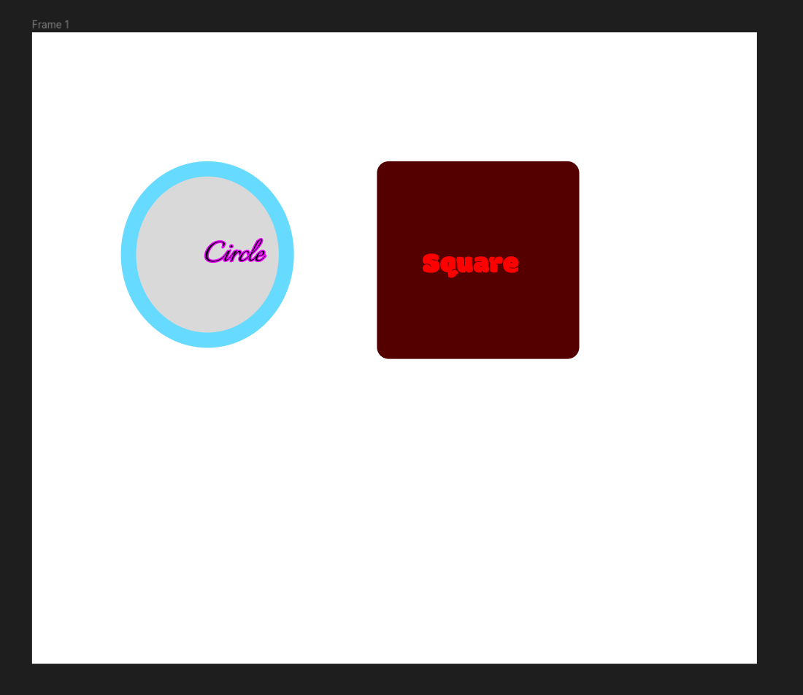
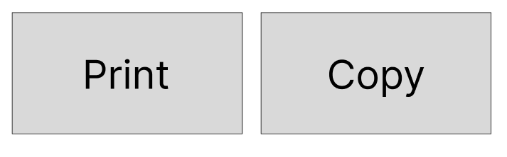
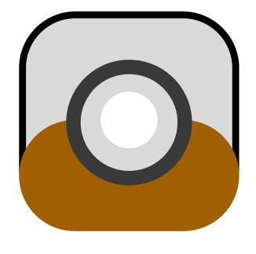
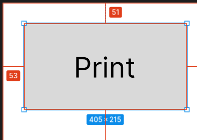
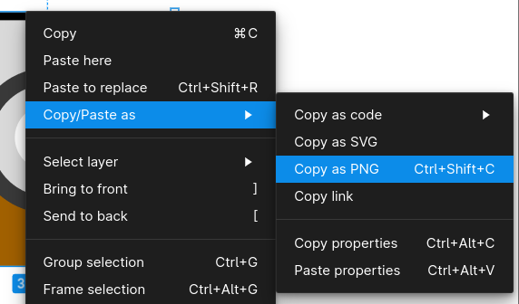
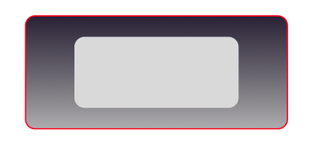
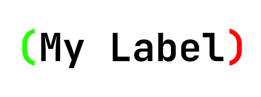

# Figma Lab

- [Overview](#overview)
- [Creating Your Figma Account](#creating-your-figma-account)
    - [Google Email](#google-email)
    - [Personal Email](#personal-email)
- [Finalizing account](#finalizing-account)
- [Creating Your First Figma Project](#creating-your-first-figma-project)
    - [Adding Elements to Project](#adding-elements-to-project)
        - [Adding a Frame](#adding-a-frame)
        - [Adding a Rectangle](#adding-a-rectangle)
        - [Adding a Circle](#adding-a-circle)
        - [Adding a Label](#adding-a-label)
- [Adjusting Properties](#adjusting-properties)
    - [Changing Corners](#changing-corners)
    - [Changing The Label](#changing-the-label)
    - [Changing Font](#changing-font)
    - [Changing Shape Colors](#changing-shape-colors)
        - [By now your Figma board should like something like this](#by-now-your-figma-board-should-like-something-like-this)
- [Challenge Object 1](#challenge-object-1)
- [Challenge Object 2](#challenge-object-2)
    - [A Quick Tip](#a-quick-tip)
- [Porting Objects to a ACM Java Project](#porting-objects-to-a-acm-java-project)
    - [Exporting as attributes](#exporting-as-attributes)
    - [Exporting as an Image](#exporting-as-an-image)
- [Drawbacks](#drawbacks)
    - [Gradients](#gradients)
    - [Mixed Colors on Labels](#mixed-colors-on-labels)
    - [And More](#and-more)
- [What's Next?](#whats-next)
- [Turn In](#turn-in)

## Overview

Have you heard of Figma before this class? If not, this lab is for you.

This lab will be teaching you the simplest core functions of Figma to
help you create a seamless, connected UI across all screens in your Comp 55 Projects.

**Figma** is a powerful tool to help you line up your ideas before you
begin coding them, which is important if you generally like
to jump in and begin programming.

Upon completing this lab you will know how to:

- Create a Figma project
- Add objects onto your Figma project
- Edit object's properties
- Be able to port the design into a java project

The submission for this lab will be:

A Figma page that is described in [further detail below](#turn-in).

## Creating Your Figma Account

To Get Started with this lab, we will assume you've never touched Figma
before and need to start by opening the website.

Navigate to [Figma](https://www.figma.com/) and then continue.

You'll immediately see a pretty website; however, we want to just create an account.

Find the button in the upper-right corner that says *Get started for free*


You can use [Continue with Google](#google-email) or a [Personal email](#personal-email).
I would recommend just using your school email, so just click on *Continue with Google*

### Google Email

If you chose the *Continue with Google* option:

- Click on your signed-in school account.
- Then it should take you to your home screen.
- Now you have successfully created your Figma account.

### Personal Email

If you chose on the Personal Email Option;

- You will need to fill in some fields instead of just pressing a few buttons.
- Type in your email address and a password for this new account.
- I would recommend disabling the Figma emailing list,
but that's up to you to decide.
- You will be provided with a message sent to that email, where you
will need to click to verify your account.
- Go ahead and click it to confirm.

After following it your account will be verified and you will need to log in.

## Finalizing account

About here is where both routes of creating an account come together.

- Complete the prompts that are provided.
- When you get to a step regarding a plan, pick the free one, as
the premium features aren't needed.
- On the final step, it will tell you to create a new file, go ahead and decline this.

Make sure to navigate to the home page before moving to the next step.

## Creating Your First Figma Project

At this point, if you're inside of a project, go ahead and click on the
logo in the top left and then go back to files.

Once you're on the home page you can click on ***design file*** in the top right.

You will now be inside of your project and can move on to the next step.

### Adding Elements to Project

Now that we are inside of an empty project we can begin adding objects to our board.

#### Adding a Frame

Figma's main power is helping you orient objects in reference to the top
left corner, which is how ACM orients GObjects.

- To simulate a screen space for our graphics window we will select the frame tool,
and then click and drag to create a new frame.
- *Tip: If you hover over a tool it will tell you what it is.*
- Drag this to about 1240 x 1080.

#### Adding a Rectangle

- Inside of the previous frame, we can begin adding objects to it.
- For this step go ahead and drag the rectangle in at any size you would like.

#### Adding a Circle

- In an open space click and drag to create a circle as well.

#### Adding a Label

Inside of both shapes create a label for both in the same manner.

- The tool you will use is the square that has a capital 'T' on it.
- Name each label to the corresponding shape.
- Ignore the small size of the label for now, as we'll change it in another step.

## Adjusting Properties

Now that we have some shapes created we can start editing the shapes to
make them look different.

### Changing Corners

After clicking on the rectangle you can access the properties on the right side.


For the corners option, you can select the option to the right of the
curved line and switch that to *`20`*.

You'll immediately be able to see that the rectangle is now nicely
rounded and not as sharp.

### Changing The Label

To change the label, we'll start off with changing the color and alignment

- Change the label so that the *circle* is right bound, and the *square* is left bound.
- Along with this, highlight the text and then increase the font size to
a more reasonable size, but do not exceed the size of the shape.
- Also go ahead and change the ***fill*** color of the square so that
the text is red.
- On the circle, navigate to the stroke, press the plus sign to add a
stroke modifier and then change the stroke color to pink.

### Changing Font

Figma has a lot of built-in fonts, this is something to take note of,
as I'm not sure whether or not they are built-in windows fonts, meaning
they might not exist inside of ACM.

For this step change the font of the circle to *Italiano* and the square
into any font you think looks good and then move on.

### Changing Shape Colors

I won't explain this step as it's akin to the previous steps for changing
the color and stroke of a label.

Change your square to a *dark red* and then change your circle's stroke to a
*light blue*, and line weight somewhere between *20* and *30*.

#### By now your Figma board should like something like this

*"Graphic Design is My Passion"*


## Challenge Object 1

Here's the first challenge shape or shape(s).
Try to make something as similar to this as possible.



## Challenge Object 2

Here's another challenge shape, a little harder but I'm sure you can do it.

A good thing to note about this shape is the hierarchy of items on the left
side, the higher up the object is, the more in front it is.
This is exactly how the ACM library works.
The order of the objects and how you add them can allow you to create complex shapes.



### A Quick Tip

A lot of organization down the road comes down to **Grouping**. Grouping is very important because it makes your hierarchy a little more manageable.

To group objects, select the components you would like to group and then press ***Ctrl + G***. This will group them and make it into a single project named *Group [`x`]*,
with `x` being how many currently exist.

## Porting Objects to a ACM Java Project

So once you've created these shapes you can go ahead and export these objects to an empty acm project.

There are two ways to export objects that we will commonly be doing as attributes and as images.

> **NOTE:** When porting to an ACM project, if you **hold *Alt*** while having an
object selected,
> it will you show the distance it is from the top and the left side.
> This is perfect for ACM as you always have to create your `GObject`s in
> reference to the top left corner.
>
> 
>

### Exporting as attributes

To export as attributes we will need to think about what `GObject`s can correspond with matching objects.

For example the challenge shape from before, you can recreate this object using the properties.

```java
  public class ACM_Example {
      // print rectangle
      GRect print_rectangle = new GRect(53, 51, 405, 215);
      GLabel print_rectangle_label = new GLabel("Print", print_rectangle_image.getX() + 74, print_rectangle_image.getY() + 67);

      // copy rectangle
      GRect copy_rectangle = new GRect(490, 51, 405, 215);
      GLabel print_rectangle_label = new GLabel("Copy", copy_rectangle_image.getX() + 74, copy_rectangle_image.getY() + 67);
  }
```

This code will create two GRects and two GLabels, with each one being in correspondence to their locations in the image.

> You could also use something like `GButton`, but just remember that for convenience, `GButton` automatically sizes the text.
> As a GButton though, the rough approximation becomes:
> `new GButton("Print", 53, 51, 405, 215)`

### Exporting as an Image

The much easier solution to get your designs in Figma to look the same in ACM is to export your design as an image.

If you look back at the second challenge, you wouldn't want to create
several GRoundedRects and other shapes to recreate it.

The way to export an object is to *select all the elements you would like to be supported*,
so in this case, I would *highlight all the existing shapes* and then ***right-click***.
Then select ***Copy/Paste as -> Copy as PNG*** (or use ***Ctrl-Shift-C***).



This will now save it to your clipboard.
If you're on a Windows computer you can paste it into MS paint or paint 3d to save the image.
Another option is to open Discord and then paste the image into there, send the image, and then
re-download the image.

## Drawbacks

Now that we've covered how to do cool things with Figma,
now we're left with what we **can't** do in Figma.

### Gradients

Gradients are impossible for you to export as a component,
as you can only export it as an image.
So if you need to adjust the gradient over time, you will have a hard time.

A good example of this is this object I had used in the past.



### Mixed Colors on Labels

Another drawback is mixed color labels, as GLabels inside of
ACM cannot handle this kind of interaction,
meaning you would have to export the label as an image as well.
That can work unless you need to change the label over time, which in that case you'll have to make images for all of the changes.

Here's a nice example is this label:



### And More

These two drawbacks are the only two I've ran into so far.
However, there are most likely plenty more cases where you'll
60% of the time just be exporting your elements as images.

## What's Next?

Well, that's up to you to decide where you will use this tool.
You could use this, you could also not and that's fine too.

I am mostly sharing this tool so I can save you time on your projects
in the way that it has saved me time as well,
so I hope you can use the strengths of this application inside of your future projects.

## Turn In

You will be turning in a Figma board that lays out a single-page website.
This website should contain your:

- First Name
- Last Name
- Major
- One Fun Fact

Additionally, you will also need a top bar that contains 3 buttons.

- My classes
- My Resume
- My College

All of these components will be up to you to style however you would like,
this includes any decisions on color and fonts.

> Grouped elements will be an expectation for multi-component objects.
