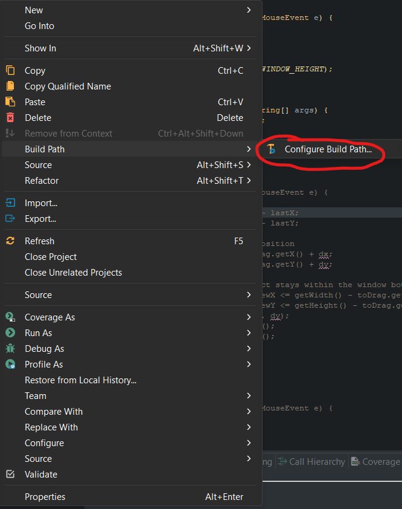
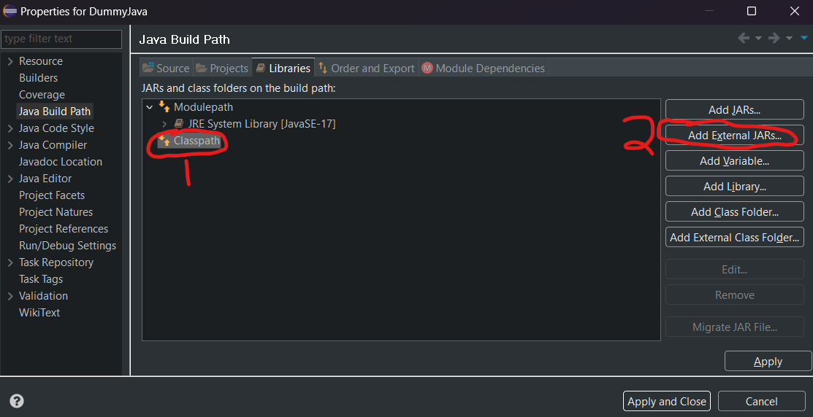
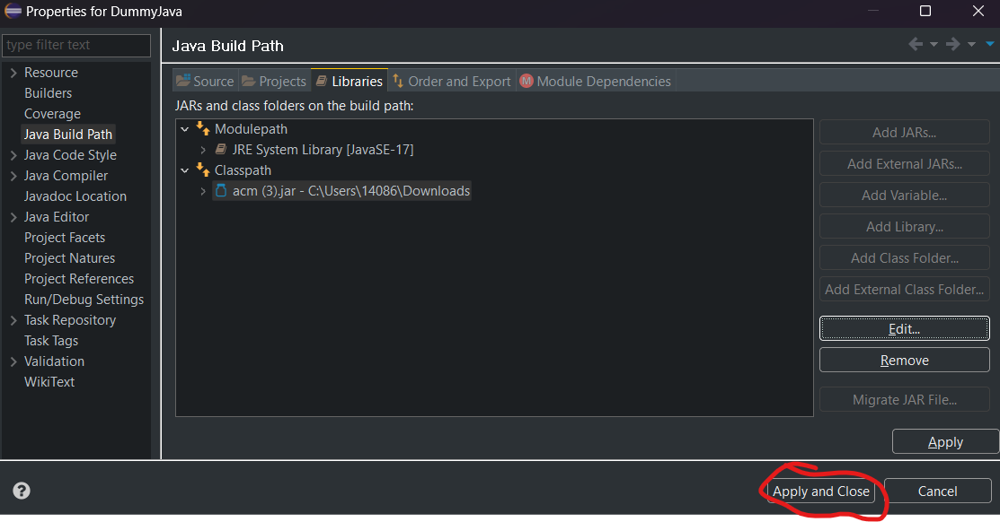
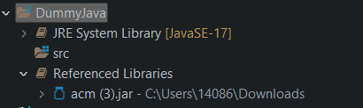

# Git Tips

Here are a few things you must know to use Git and not have it
use you.

1. Ensure your team member uses the project I've given you to setup the repository

    - While you may be tempted to use another project or code that
        someone else has done,
        It's best to use the project I've given you as a starting point
        as it has the acm.jar file embedded
        as well as all the hidden details needed to have your teammates checkout the project
        and have it immediately run.

2. Be careful what you commit

    - If you end up using the project that I've provided,
        after the first commit done by the team member setting up the project,
        .project and .classpath should not be present in the commit files.

3. Look at the icons in your project closely: Here is a list of icons
    with filenames that give a partial explanation of what is happening with files in your project.
    **Do note that the following icons are the ones seen in classic eclipse view
    and their appearance changes when using other themes!**

    

    Some of the most important icons here are the ">" symbol.
    This indicates that the project and subsequently,
    some files (in this case
    ```conflict.txt```,
    ```dirty.txt```,
    and ```partially-staged.txt``` as well as ```folder```)
    are **dirty**,
    which is that they are different than the current head of the repository.
    Normally as soon as you make changes,
    you'll see differences here.

    Next,
    we'll talk about **untracked** files.

    

    Untracked means that the file is currently not being kept track of in the repository,
    decide whether or not you want to keep track of it.
    If you do,
    then you can add it to the index.

    

    The last one,
    **conflict**,
    is an important one to take notice of,
    as you'll have to resolve any conflicts there
    before you're allowed to continue contributing to the project.
    It's best if you resolve the conflicts
    by following the steps in Tip #4.

4. If your project isn't being pushed,
   look at the errors that are being given!
   Read what git is telling you.
   Sometimes you'll need to keep committing and then pulling until everything is up to date,
   once you have no more conflicts and you've pulled you should be able to commit and push.

    - Sometimes you're working on your code
    while one of your other team members pushes a later version of the code to the repository.
    If so,
    git won't let you push the code,
    no matter how many times you try,
    until you merge your changes with the changes in the repository.
    To do this,
    after you commit,
    do a pull,
    and most likely you'll get a couple of files that have conflicts in them.
    This means that you'll have to open them up
    and remove the errors and decide what the right piece of code for that area is.
    Once you do that,
    then you'll be able to add the file again to the index and commit again.
    You can then try to push again
    (You can just use the option "push upstream".
    If it won't let you, continue the pull and merge.

    Here is what a conflicting merge looks like:

    

   When there are conflicting merges, this means that you'll have to choose between
   your changes or the changes from the branch you're merging with.
   Typically, you'll select one set of changes but on occasion you may need to select changes from both.
   To get a better understanding of this, you can go to [step 8 of the GitHub Lab](9-Github.html#step-8-martyr--hackslash---commit-and-push-the-same-line).

5. If you're having issues with the repository,
   you can always reset your folder to match the latest version.
   To do this,
   right-click on the project,
   then select ***Team->Reset….***
   Make sure to select the remote version or the local version
   of the repository you want to switch to,
   and then select a hard reset,
   which will attempt to replace your entire folder contents with what is in that version.
   Know that if you do a hard reset,
   you will lose any changes you made,
   so only do this as a last resort or if you haven't made changes and just want the latest part.
   This is also useful for when you have a dirty project
   (which you can tell when the greater than sign is present next to the project).

## Java Build Path - Adding a folder of images

When importing your project into Eclipse
there are times when certain folders are not in the java build path.
Let's take for example a media folder containing images for your project
that's not in your java build path.

The console will return an error telling you it cannot find the image.


The first thing you want to do is right-click your *project-name* in your project explorer
and click on the *properties*.
You will be greeted with this window:


1. Click *Java Build Path*
2. Click on the *Source* tab
3. Click on *Add Folder*

Now you are met with the Source Folder Selection
where you can check the folder you want to include and you are done!


## Adding ACM Library

Creating your own project in Eclipse can be pretty easy to do.
But what if you wanted to use certain libraries such as ACM.
To solve this issue, you will need to download jar files.
I will provide the link of where to downlaod the jar file from and how to install onto your
Eclipse project to use.

### 1. Download the acm.jar file

   You can go to this link to download the acm jar file:
   [DropBox ACM Jar](https://www.dropbox.com/scl/fi/pq2vj3eh6kjt3hq0jcckw/acm.jar?rlkey=4vuat5s13i8xv1be7lac3aeap&dl=0)

   Then you would want to click on download. You can choose to sign up but I recommend
   to just to click *"Or continue with download only"*

### 2. Adding acm.jar file

   Now you would want to open your eclipse project and right click the project
   you want to add the acm.jar to.
   After right clicking on it, you would want to click on BuiildPath.
   If that is not avaliable make sure it is a java project.

   

   Then you would want to click on classpath and add external jar.

   

   Depending on where you store your downloads on Mac or Windows, click on the
   downloaded acm.jar file and it should
   automatically appear under the classpath as the image below.
   Then all you have to do is apply and close and it should be in your
   project under the Referenced Libraries folder.

   

   

### 3. Alternative

   There is an alternative from downloading the acm.jar and then putting it in your project.
   Just make an empty gradle project and start from there.
   Before we do all of that work, you need to understand what a gradle project is.

   An example is like a carpenter. He has all of these tools. These tools make doing the
   job faster, easier, and more efficent. Think of build tools as the same thing but for
   software development.

   Some examples of these build tools are Apache Ant, Apache Maven, but
   the one we will be using or intergrating today is Gradle. Gradle is an-open source build
   automation tool. It is known as the successor for Apache Ant and Maven. To learn more about
   Gradle just click on this link [Gradle UserGuide](https://docs.gradle.org/current/userguide/userguide.html)

   ###Checking if you have Gradle

   I will show you now how to create the Gradle project onto your project.
   On Eclipse and depending on your previous
   tasks you cna have Gradle already installed. So go to File and New. Then go down to Other.

   ###Install Gradle

   You should see a window. In the search bar, you want to search up Gradle.
   That shows you do have gradle installed.
   If not go to Help and then Eclipse Marketplace.

   AddIMAGE
   EclpiseMarketSpace

   Then search up gradle in the search bar and download Buildship Gradle 3.0.
   Once installed, you should be able to do the
   have access to Gradle. Then when you import any project such as the
   labs for comp 55, you will have access to creating a Gradle project.

   ###Creating Gradle Project

   All you have to do now is click on ***File -> New -> Project*** Then in the search bar,
   you will enter gradle. Click on gradle project. Then enter your project name and click next.
   No need to change any override any settings and click next. It should start to load in now.
   All you need to press is finish. A problem that occurs is that the lib file does not appear in
   the project you created. First go to the lib project that was created and drag ***build.gradle***
   onto the project you made. After that, what you want to do is go to ***settings.gradle***
   in the folder name you created and delete the ***include('lib')***.
   Then you want to save and refresh gradle project. Now you can delete the lib project off disk and
   you should be good to go.
